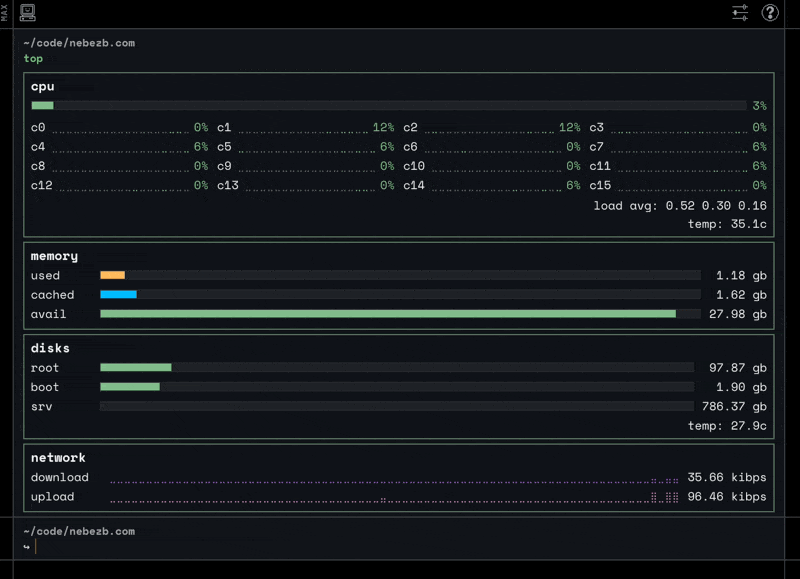

# webtop-gen

`webtop-gen` captures live Linux host telemetry (CPU, memory, disks, network, temperatures) as JSON for an interface to consume in batched ticks. Scroll down for `systemd` install instructions.

It's currently being used to generate frontend-friendly metrics for the `top` command at [nebezb.com](https://nebezb.com/).

<p align="center">
    
</p>

## Requirements

- `node`
- `df`
- `/proc`
- `/sys`
- *optionally* `lm-sensors` (`sensors`) for explicit sensor selection
- *optionally* `nut-client` (`upsc`) for UPS metrics

## Usage

```bash
node webtop-gen.js --out=stats.json
```

- `--out=<path>` output file path (required)
- `--updates=<n>` number of updates to capture (default: `10`)
- `--interval-ms=<n>` delay between updates in ms (default: `1000`)
- `--iface=<name>` network interface override (default: auto-detect)
- `--max-disks=<n>` max disk rows to emit (default: `8`)
- `--cpu-temp-id=<id>` preferred CPU sensor id (e.g. `k10temp-pci/Tctl`)
- `--disk-temp-id=<id>` preferred disk sensor id (e.g. `nvme-pci/Composite`)
- `--ups-server=<target>` optional NUT `upsc` target (e.g. `ups@home-server.local`, or `upsc ups@home-server.local`)
- `--help` show help

Example:

```bash
node webtop-gen.js \
  --out=/tmp/stats.json \
  --updates=10 \
  --interval-ms=1000 \
  --cpu-temp-id="k10temp-pci/Tctl" \
  --disk-temp-id="nvme-pci/Composite" \
  --ups-server="ups@home-server.local"
```

> **note**: by default, disks with `efi` in the name are excluded. 🤷

## Discovering sensor IDs

Use `chip/label` exactly as shown after running `sensors`:

- CPU: `k10temp-pci/Tctl`
- Disk: `nvme-pci/Composite`


## systemd

I write these stats to a file on my server every few seconds using systemd. If you want to do the same, use a service file similar to the one below. Pay attention to `YOUR_USER` and `SCRIPT_PATH` placeholders.

`/etc/systemd/system/webtop-live.service`

```ini
[Unit]
Description=Generate webtop live JSON snapshot
Wants=network-online.target
After=network-online.target

[Service]
Type=oneshot
User=YOUR_USER
Group=YOUR_USER
WorkingDirectory=SCRIPT_PATH
ExecStart=/usr/bin/node SCRIPT_PATH/webtop-gen.js --out=/tmp/stats.json --updates=10 --interval-ms=1000 --cpu-temp-id=k10temp-pci/Tctl --disk-temp-id=nvme-pci/Composite --ups-server=ups@home-server.local
```

`/etc/systemd/system/webtop-live.timer`:

```ini
[Unit]
Description=Run webtop generator every 10 seconds

[Timer]
OnBootSec=10s
OnUnitActiveSec=10s
AccuracySec=1s
Unit=webtop-live.service
Persistent=true

[Install]
WantedBy=timers.target
```

#### Installation

```bash
sudo systemctl daemon-reload
sudo systemctl enable --now webtop-live.timer
sudo journalctl -u webtop-live.service -f
```
